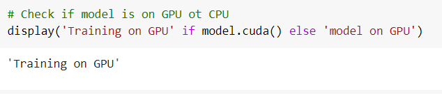

# tsai_end2.0_Session_3


# Architecture used
    MNIST IMAGE INPUT -->  CONV1(ReLU)  --> AVGPOOL --> CONV2(ReLU) --> AVGPOOL --> FLATTEN --> DENSE1(SIGMOID) --> DENSE2(SIGMOID) --> DENSE3(SOFTMAX) [Y1-HAT]
				
				
           Y1-HAT ----- 
                      |
                      |----------------> DENSE4(SIGMOID) --> DENSE5(SIGMOID) -->  DENSE6 [Y2-HAT]
                      |
    RANDOM NUMBER -----


# Data representation
MNIST data is downloaded from torchvision dataset link in the format of _training.pt_ and _test.pt_ where both files are numpy Binary file. Here, the images have 1 channel represented by a 28x28 matrix. The number of images are 6000 per label. There are a total of 10 labels (0-9), hence 60000 total images in the train dataset. Similarly, we have a separate test dataset of 10000 images with equal bin size per label.

# Data generation strategy
For the randomly generated numbers that are to be added to the labels we generate it using _torch.randint_, which of the same size of the training data and another tensor for test data. We add the randomly generated numbers to the ground-truth labels of MNIST to create _y2_ where _y1_ is the ground-truth labels of MNIST. A custom data-loader has been created to feed data into the model with batch-size 128 and also shuffle the data in the same data-loader.

# How have we combined the two inputs?
We pass the image and the randomly generated number to the model as inputs, where we predict the input to the label and then **stack** the _y1-hat_ (MNIST predicted label) with the randomly generated number assigned for that image. This has been done inside the model to create a dataset for further prediction of the summation function.

# How are we evaluating our results?
To evaluate the results, we calculate the total number of predictions that exactly match the labels _y1-hat_ (MNIST predicted label) and the _y2-hat_ (MNIST + random number predicted label). Further, we add the loss from both prdeictions to understand how the loss is being minimized.

# What results did we finally get and how did we evaluate our results?
```
total_correct_labels: 97.4% | total_correct_sum: 96.6%
```
_total_correct_labels_ are the number of MNIST labels correctly predicted by our model which is 97.4% while _total_correct_sum_ is the number of correctly predicted labels for MNIST label + Random number. Our model is correctly predicting it upto 96.6%.
```
total_correct_labels = correctly predicted y1-hat / total MNIST labels

total_correct_sum    = correctly predicted y2-hat / total MNIST labels
```
We use the test accuracy to evaluate our results for both labels and sum.


# What is the loss function that we picked and why?
In the case of multiple-class classification, we can predict a probability for the example belonging to each of the classes, we have used a _cross-entropy_ loss function, also referred to as Logarithmic loss. The problem is framed as predicting the likelihood of an example belonging to each class. We have used cross entropy loss since, the penalty is logarithmic, offering a small score for small differences (0.1 or 0.2) and enormous score for a large difference (0.9 or 1.0). Since the activation function for the output layer is **Softmax** and it is a continuously differentiable function, this makes it possible to calculate the derivative of the loss function with respect to every weight in the neural network. This property allows the model to adjust the weights accordingly to minimize the loss function (model output close to the true values).


# How did we train our Pytorch model on GPU?
Attaching screenshot of our codebase showing our model on GPU.



# Team Members
- Anirban
- Debashish
- Bipin
- Meena
- Pavithra 
