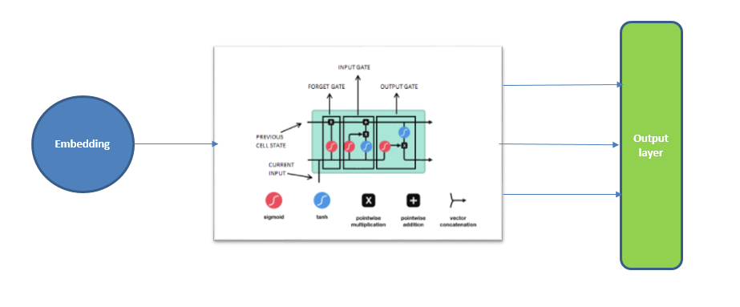
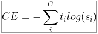
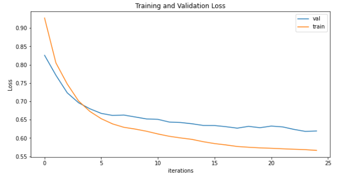
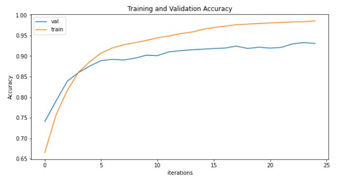
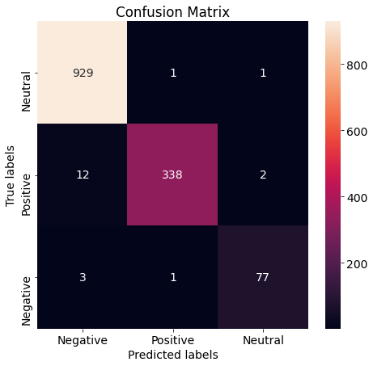
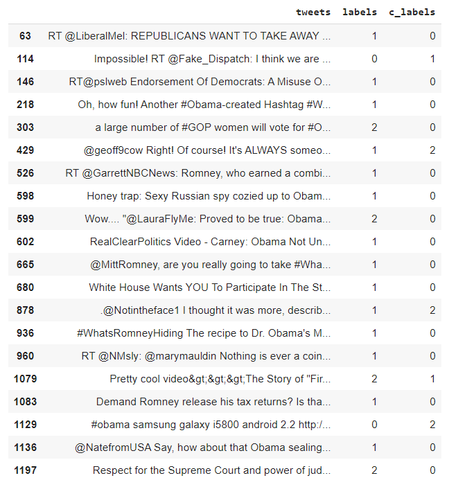

# Twitter Sentiment Analysis 


- [Objective & Data description](#objective--data-description)
- [Proposed Solution](#proposed-solution)
- [Augmentation](#augmentation)
- [Model and Loss function](#model-and-loss-function)
- [Results: Accuracy, Loss](#results-accuracy-loss)
- [Sample Outcomes](#sample-outcomes)


## Objective & Data description
The objective is to classify sentiments of the given tweets from the file 'tweet.csv' provided on canvas. The dataset consists of **1364** tweets with their percieved sentiments as labels. This was also to be achieved by using various NLP data augmentation techniques like "Back Translate", "random_swap" and "random_delete".

## Proposed Solution
Since we only have 1364 tweets, hence we augment the data using multiple augmentation techniques to increase our data-size to train our models better. For the model, we use a multi-layer LSTM model fed by an embedding layer. To classify the tweets into their perceived sentiments from the LSTM layer, we use a fully connected layer with output dimension equal to the number of sentiment labels present in the dataset.



## Augmentation
Data augmentation in data analysis are techniques used to increase the amount of data by adding slightly modified copies of already existing data or newly created synthetic data from existing data. It acts as a regularizer and helps reduce overfitting when training a machine learning model.
We have used 4 data augmentation techniques:
- **random_insertion**: we randomly insert synonyms of a word at a random position in the sentence
- **random_deletion**: we randomly delete a word from the sentence. This is achieved by generating a random number from a uniform distribution for each of the words in the sentence. This generated number between 0 and 1, and the words smaller than than the pre-defined threshold for every sentence. This allows for a random deletion of some words from the sentence
- **random_swap**: we randomly swap the order of two words in a sentence. To achieve this, we smaple two indices (index1 != index2; index1 & index2 < length of sentence > 1)
- **translate_and_back**: we take a sentence and convert it to a language randomly chosen from the **_google_trans_new_** library's list of languages and then translate it back to english, which is the original language of our tweet. We use translate only 4% of the times to limit the API calls to google server and avoid bad_request timeouts

We augment each of the tweet 6 times, **randomly** choosing one of the 4 augmentation techniques mentioned above with probabilities of 32% each for the first three and 4% for translate_and_back. We have kept our augmentation per tweet to 6 times so as to reduce our data augmentation runtime. This can be exceeded to 16 based on the paper[^1].


## Model and Loss function
As discussed in proposed architecture, we use a model with embedding, 2 LSTM and fully connected layers.  First we pass our augmented and original dataset through _spacy_ to tokenize it. Post tokenizing, we split the data into training and validation dataset in a 80:20 ratio. Using train dataset we create a vocabulary. To feed train and validation dataset into our model, we create a bucket-iterator. 

We use _Adam_ optimiser with a learning rate of 2*10^-4 and _CrossEntropyLoss_ 



Cross entropy loss is used since  it is a multi-class classification problem.
This model was trained for 25 epochs. 
```
Epoch 1 | Time Taken: 26.23s
	Train Loss: 0.927 | Train Acc: 66.52%
	 Val. Loss: 0.826 |  Val. Acc: 74.05% 

Epoch 2 | Time Taken: 24.69s
	Train Loss: 0.805 | Train Acc: 75.73%
	 Val. Loss: 0.771 |  Val. Acc: 79.07% 

Epoch 3 | Time Taken: 24.71s
	Train Loss: 0.747 | Train Acc: 81.67%
	 Val. Loss: 0.723 |  Val. Acc: 83.89% 
.....	 
.....	 
.....
Epoch 23 | Time Taken: 25.03s
	Train Loss: 0.569 | Train Acc: 98.30%
	 Val. Loss: 0.624 |  Val. Acc: 92.97% 

Epoch 24 | Time Taken: 24.84s
	Train Loss: 0.568 | Train Acc: 98.37%
	 Val. Loss: 0.618 |  Val. Acc: 93.28% 

Epoch 25 | Time Taken: 24.90s
	Train Loss: 0.566 | Train Acc: 98.57%
	 Val. Loss: 0.619 |  Val. Acc: 93.07% 
	 
```
As we can see, the model starts from 74% validation accuracy and 0.826 validation loss which by 25th epoch is decreased to  Val. Loss: 0.619 |  Val. Acc: 93.07% . 

## Results: Accuracy, Loss
Post training our model, we get a training accuracy of 98.57% and a validation accuracy of 93%. Also, we calculate the **f1 score** of **98.52%**. 

The training and validation loss the model:



The training and validation accuracy the model:




Here is the confusion matrix detailed the misclassifications.



## Sample Outcomes
The mis-classification results were evaluated and following were the results:



[^1]  **EDA: Easy Data Augmentation Techniques for Boosting Performance on Text Classification Tasks** (https://arxiv.org/abs/1901.11196)


## Group

- Anirban Mukherjee
- Debasish Sarangi


